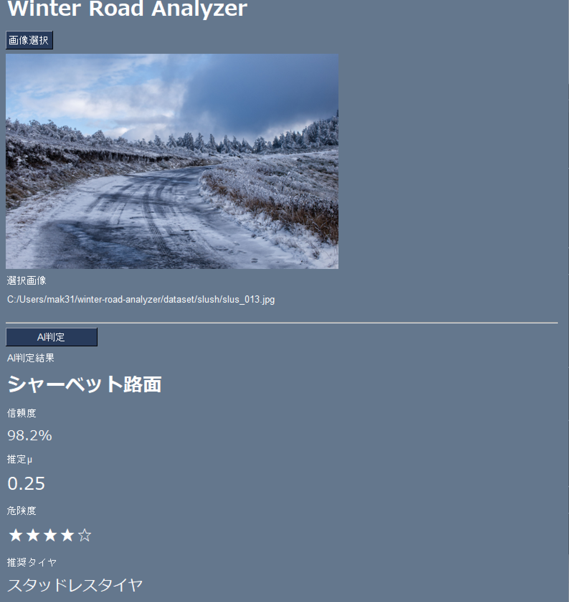

# Winter Road Analyzer

Winter Road Analyzer は、スタッドレスタイヤ開発で得た知見を活かし、冬季路面を画像から認識し、安全運転支援情報を提供するAIアプリケーションです。

路面画像をAIが解析し、

- 路面状態判定
- 推定摩擦係数（μ）
- 危険度評価
- 推奨タイヤ
- 推奨速度
- 制動距離係数
- 運転アドバイス

を表示します。

将来的には、自動運転やADAS（先進運転支援システム）への応用を目指しています。

---

## 開発背景

スタッドレスタイヤ開発では、路面状態と摩擦係数（μ）の関係が重要です。

本プロジェクトでは、スタッドレスタイヤ開発で得られる知見をAIへ取り込み、

```text
路面画像
↓
AI判定
↓
路面状態
↓
μ推定
↓
危険度評価
↓
安全運転支援
```

を実現することを目的としています。

---

## 使用技術

- Python
- TensorFlow
- Keras
- PySimpleGUI
- Pillow
- NumPy
- Git
- GitHub

---

## 主な機能

### GUI画面


---

### 路面画像表示

選択した路面画像をGUIに表示します。

### AI路面判定

以下の5種類の路面を分類します。

- Dry（乾燥路面）
- Wet（湿潤路面）
- Slush（シャーベット路面）
- Snow（圧雪路面）
- Ice（凍結路面）

### 信頼度表示

AI判定結果の信頼度を表示します。

例：

```text
信頼度
98.2%
```

### 推定摩擦係数（μ）

路面状態に応じた推定μを表示します。

### 危険度評価

★の数で危険度を表示します。

### 推奨タイヤ表示

路面状態に適したタイヤを表示します。

### 推奨速度表示

安全運転の目安となる速度を表示します。

### 制動距離係数表示

乾燥路面に対する制動距離倍率を表示します。

### 運転アドバイス表示

安全運転のためのアドバイスを表示します。

---

## 路面評価ロジック

| 路面状態 | μ | 危険度 | 推奨タイヤ |
|-----------|------|-----------|-----------|
| 乾燥路面 | 0.80 | ★☆☆☆☆ | サマータイヤ |
| 湿潤路面 | 0.50 | ★★☆☆☆ | オールシーズンタイヤ |
| シャーベット路面 | 0.25 | ★★★★☆ | スタッドレスタイヤ |
| 圧雪路面 | 0.30 | ★★★☆☆ | スタッドレスタイヤ |
| 凍結路面 | 0.10 | ★★★★★ | 高性能スタッドレスタイヤ |

---

## AI分類クラス

```text
dry
wet
slush
snow
ice
```

---

## データセット構成

```text
dataset
├─ dry
├─ wet
├─ slush
├─ snow
└─ ice
```

現在の学習画像数

```text
dry      20枚
wet      20枚
slush    20枚
snow     20枚
ice      20枚
```

合計

```text
100枚
```

---

## フォルダ構成

```text
winter-road-analyzer
│
├─ dataset
│   ├─ dry
│   ├─ wet
│   ├─ slush
│   ├─ snow
│   └─ ice
│
├─ models
│   └─ winter_road_model.keras
│
├─ screenshots
│   └─ gui_v4_result.png
│
├─ src
│   ├─ road_analyzer.py
│   ├─ train_model.py
│   ├─ predictor.py
│   └─ gui_v2.py
│
├─ README.md
├─ requirements.txt
└─ .gitignore
```

---

## 実行方法

### 仮想環境作成

```bash
python -m venv .venv
```

### 仮想環境有効化

```bash
.venv\Scripts\activate
```

### ライブラリインストール

```bash
pip install -r requirements.txt
```

### AIモデル学習

```bash
python src/train_model.py
```

### アプリ起動

```bash
python src/gui_v2.py
```

---

## 実行例

```text
AI判定結果

シャーベット路面

信頼度
98.2%

推定μ
0.25

危険度
★★★★☆

推奨タイヤ
スタッドレスタイヤ

推奨速度
35 km/h以下
```

---

## 今後の改善

### v4.1

- ブラックアイスバーン対応
- 判定信頼度による警告表示

### v5.0

- データセット拡張
- AI精度向上
- モバイル対応

### v6.0

- リアルタイムカメラ入力
- 自動運転支援システムとの連携

---

## 将来ビジョン

```text
路面画像
      ↓
AI判定

乾燥
湿潤
シャーベット
圧雪
凍結

      ↓
推定μ

      ↓
危険度評価

      ↓
推奨タイヤ

      ↓
推奨速度

      ↓
安全運転支援
```

---

## 学習プロジェクト

本プロジェクトは、スタッドレスタイヤ開発経験をソフトウェアとして表現し、

「スタッドレスタイヤ開発 × AI × 自動運転」

をテーマに開発しているプロジェクトです。
